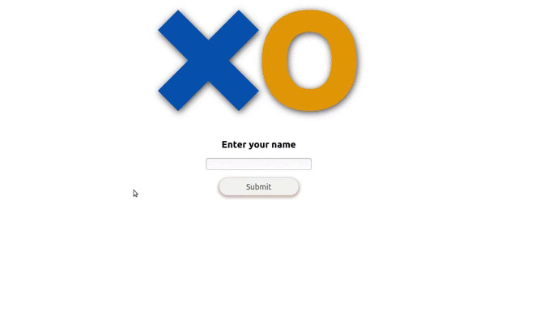

<h1 align="center">
  
  <h1 align="center">Tic Tac Toe</h1>
</h1>

<h4 align="center"><a href="https://reactjs.org/" target="_blank">React</a> based multiplayer game.</h4>


Tic Tac Toe is a React, and Redux based SPA multiplayer game. It is simple and easy to use. This game can also be played with AI.

## Demo
The game is live on
```
https://tic-tac-toe-react-app-ui.herokuapp.com/
```

Below is the gameplay demo:



## Tech/framework used

<b>Built with</b>
- [React](https://reactjs.org/)
- [Redux](https://react-redux.js.org/)
- [redux-logger](https://github.com/LogRocket/redux-logger)

## Features
- Option to choose opponent options: With AI, or with play with A friend.
- Live Score board tracking.
- Player turn tracking.
- Reset button to start game over again.

## How to use?
Steps to run the application:
```
npm install
npm start
```

## You can reach out 😊😊

Feel free to contact me about the problems. I will try to help as much as I can 😉

[](https://www.linkedin.com/in/keyur-paralkar-494415107/)
[](mailto:keur.plkar@gmail.com)
[](https://twitter.com/keurplkar)
[](https://github.com/keyurparalkar/)

## License
This project is licensed under the MIT License - see the [LICENSE](LICENSE) file for details

## Acknowledgments

- Getting Better at React
- Learning new stuffs
